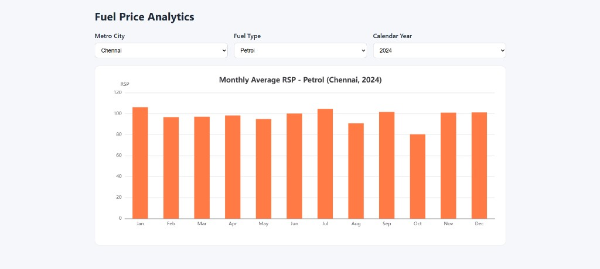

# Fuel Price Analytics Dashboard

Frontend assignment implementation using **TypeScript + Vite + Apache ECharts**.

## Features

- 3 filter controls:
  - metro city
  - fuel type (Petrol / Diesel)
  - calendar year
- Bar chart showing monthly average RSP for selected filters
- Missing CSV cell values are treated as `0` during parsing
- No helper libraries such as Bootstrap, jQuery, or Lodash

## Tech Stack

- TypeScript
- React (with Vite)
- Apache ECharts (directly, no `echarts-for-react`)

## Run Locally

```bash
yarn install
yarn dev
```

Then open the local URL shown in terminal.

## Build

```bash
yarn build
yarn preview
```

## Dataset

The dashboard reads a CSV at `src/data/fuel_prices.csv`.

CSV headers:

```text
city,fuelType,year,month,rsp
```

## Deployment URL

[Fuel Price Analytics Dashboard](https://manufac-data-analysis-app.vercel.app/)

## Dashboard Screenshot


